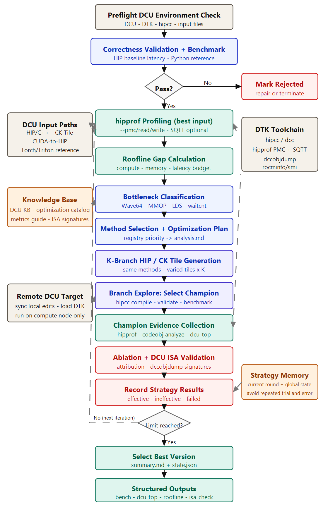

# hygon-hip-kernel-optimizer

`skills/hygon-hip-kernel-optimizer` is the Hygon DCU / HIP migration of the CUDA kernel optimizer skill. It keeps the original iterative optimization loop, but replaces the NVIDIA stack with DTK/HIP tooling:

| CUDA skill | Hygon DCU skill |
| --- | --- |
| `nvcc` | `hipcc` / DTK `dcc` |
| Nsight Compute `ncu` | `hipprof --pmc`, `--pmc-read`, `--pmc-write`, optional `--sqtt` |
| `cuobjdump` / SASS checks | `dccobjdump` / DCU ISA checks |
| CUTLASS templates | CK Tile templates |
| NVIDIA warp32 assumptions | Hygon/AMD wave64 assumptions on `gfx936` / `gfx938` |

This is a Codex skill package, not a standalone optimizer daemon. Codex reads the skill instructions and writes candidate kernels, while the scripts handle deterministic work: environment detection, benchmarking, profiling, branch selection, ISA checks, state updates, attribution, and summary generation.

If you do not have an initial HIP/C++ kernel yet, start with `skills/hygon-hip-baseline-generator`. It can inspect a Torch/Triton/TileLang/Python reference plus shape JSON, scaffold a conservative `kernel.hip` and `ref.py`, and validate correctness before this optimizer begins its measured iterations.

When this workflow is installed as a plugin and used from another repository, resolve helper scripts from the loaded skill/plugin directory. Do not assume the target repository contains `skills/hygon-hip-kernel-optimizer/scripts`.



## What It Does

For each optimization iteration, the skill:

1. Checks the Hygon/DTK environment.
2. Validates the baseline kernel and Python reference.
3. Benchmarks the current best kernel.
4. Profiles it with `hipprof` and writes `dcu_top.json`.
5. Computes a roofline-style compute/memory/latency budget.
6. Lets Codex choose methods from `references/method_registry.json`.
7. Lets Codex generate K branch kernels.
8. Benchmarks every branch and promotes the fastest correct branch.
9. Profiles the champion.
10. Dumps DCU ISA with `dccobjdump` and verifies claimed methods.
11. Optionally runs leave-one-out ablation.
12. Updates `state.json` and renders `summary.md`.

## Repository Layout

```text
skills/hygon-hip-kernel-optimizer/
  SKILL.md                         # Codex-facing procedure
  scripts/
    benchmark.py                   # HIP/PyTorch correctness and timing driver
    check_env.py                   # hipcc/hipprof/dccobjdump/rocminfo/CK Tile detection
    preflight.py                   # baseline/ref contract validation
    profile_hipprof.py             # hipprof PMC/read/write, optional SQTT, codeobj analysis
    analyze_sqtt.py                # SQTT thread_trace_*.json summarizer
    analyze_perfetto_trace.py      # optional Perfetto Trace Processor summary for SQTT JSON
    roofline.py                    # compute/memory/latency budget estimation
    branch_explore.py              # compile/benchmark K branches and elect champion
    sass_check.py                  # dccobjdump-based DCU ISA verification
    ablate.py                      # optional leave-one-out method attribution
    state.py                       # single writer of state.json
    summarize.py                   # summary.md renderer
    orchestrate.py                 # setup / close-iter / finalize wrapper
  references/
    dcu_metrics_guide.md           # hipprof counter interpretation
    dcu_isa_signatures.json        # method -> expected DCU ISA regexes
    method_registry.json           # machine-readable method catalog
    optimization_catalog.md        # human-readable optimization guidance
  templates/
    iteration_report.md            # analysis.md template
    methods.schema.json            # methods.json schema
  examples/
    walkthrough.md                 # full agent runbook
```

Temporary validation files, scratch probes, generated runs, traces, and pulled logs may live under repository-root `hygon_tmp/`. That directory is intentionally ignored by Git and is not part of the committed skill interface. Use placeholders such as `<case-dir>`, `<run-dir>`, and `<probe-dir>` in documentation unless explicitly describing a disposable validation artifact.

## Codex Usage

From this repository, ask Codex to use the skill explicitly:

```text
Use skills/hygon-hip-kernel-optimizer to optimize <case-dir>/kernel.hip.
The reference is <case-dir>/ref.py and dims is {"N":1048576}.
Validate on the remote DCU compute node, run 1 iteration, and generate 2 branches per iteration.
```

When starting from only a reference:

```text
Use skills/hygon-hip-baseline-generator with <case-dir>/ref_source.py and shape {"M":1024,"N":1024,"K":1024}.
Generate a correctness-first Hygon HIP baseline, validate it on the remote DCU, then use skills/hygon-hip-kernel-optimizer for the number of iterations I specify.
```

Codex will read:

```text
skills/hygon-hip-kernel-optimizer/SKILL.md
skills/hygon-hip-kernel-optimizer/references/
skills/hygon-hip-kernel-optimizer/scripts/
```

For this project, remote DCU validation must go through the bundled `remote-ssh-docker-workflow` skill, despite the historical name. The current workflow has no Docker layer:

1. Edit files locally.
2. Sync them to the remote shared filesystem from `.vscode/sftp.json`.
3. SSH from login node `10.102.13.101` to compute node `gc02r3n15`.
4. Load DTK/module/conda environment for that command session only.
5. Pull `hygon_tmp/` artifacts back when you need to inspect generated outputs locally.

Do not compile or profile directly on the login node unless you are only checking file presence.

## Manual CLI Flow

Manual invocation is useful when debugging the skill itself. In normal use Codex should drive this loop.

```bash
python skills/hygon-hip-kernel-optimizer/scripts/orchestrate.py setup \
  --baseline <case-dir>/kernel.hip \
  --ref <case-dir>/ref.py \
  --iterations 1 \
  --branches 2 \
  --dims '{"N":1048576}' \
  --ptr-size 1048576 \
  --warmup 2 \
  --repeat 5
```

After `setup`, Codex writes:

```text
run_YYYYMMDD_HHMMSS/iterv1/analysis.md
run_YYYYMMDD_HHMMSS/iterv1/methods.json
run_YYYYMMDD_HHMMSS/iterv1/branches/b1/kernel.hip
run_YYYYMMDD_HHMMSS/iterv1/branches/b2/kernel.hip
```

Then close the iteration:

```bash
python skills/hygon-hip-kernel-optimizer/scripts/orchestrate.py close-iter \
  --run-dir <run-dir> \
  --iter 1 \
  --warmup 2 \
  --repeat 5
```

Render the final summary:

```bash
python skills/hygon-hip-kernel-optimizer/scripts/orchestrate.py finalize \
  --run-dir <run-dir>
```

Each script also supports `--help`.

## Kernel Contract

HIP/C++ kernels should expose a host-side entry point named `solve`:

```cpp
extern "C" void solve(const float* x, float* y, int N) {
    // choose launch config and call one or more __global__ kernels
}
```

The Python reference should expose `reference`:

```python
def reference(x, y, N):
    y.copy_(...)
```

Pointer parameters are allocated as ROCm PyTorch GPU tensors by `benchmark.py`. `const` pointer parameters are treated as inputs; non-const pointer parameters are treated as outputs and checked against the reference. Scalar dimensions are passed through `--dims`.

Supported kernel file extensions are:

```text
.hip, .cu, .cpp, .cc, .cxx, .py
```

The `.cu` extension is accepted for migration convenience, but new DCU kernels should normally use `.hip`, `.cpp`, `.cc`, or `.cxx`.

## Output Files

A run directory contains:

```text
run_YYYYMMDD_HHMMSS/
  env.json                         # Hygon/DTK environment snapshot
  state.json                       # persistent optimizer state
  baseline/
    <baseline kernel>
    bench.json
  iterv1/
    best_input.hipprof.csv/log     # profile of the input kernel
    best_input.hipprof.pmc_read*/  # read-side PMC outputs when generated
    best_input.hipprof.pmc_write*/ # write-side PMC outputs when generated
    best_input.hipprof.codeobj_analyze.log
    best_input.hipprof.sqtt_analysis.json
    dcu_top.json                   # parsed profiler evidence
    roofline.json                  # axis gaps and method budget
    analysis.md                    # Codex reasoning for this iteration
    methods.json                   # selected method IDs and skip reasons
    branches/b*/kernel.hip         # candidate branch kernels
    branches/b*/bench.json
    branch_results.json
    kernel.hip                     # champion source
    kernel.so                      # compiled shared object
    kernel.hipprof.csv/log         # champion profile
    isa_check.json                 # dccobjdump and DCU ISA pattern checks
    attribution.json               # optional ablation attribution
    bench.json                     # champion benchmark
  summary.md
```

`summary.md` reports baseline time, best time, speedup, best kernel path, best `hipprof` output, method buckets, and branch frontier.

## Method Selection Rules

Codex should choose methods from `references/method_registry.json`, constrained by `roofline.json`:

- total selected methods per iteration equals the axis budget sum;
- per-axis budget is capped;
- higher-priority methods must be selected or explicitly skipped;
- valid skip reasons are `already_selected`, `arch_incompatible`, `feature_unavailable`, `skip_condition`, and `no_trigger`;
- coupled methods should not double-count the same code change.

Important DCU method families include:

- compute: MMAC/HCU matrix core usage, FP8/BF8/TF32, wave64 launch geometry, thread coarsening, inline asm or HCU builtin fallback;
- memory: coalesced global access, vectorized global load/store, LDS tiling, matrix-load/MLS staging, LDS bank conflict reduction, CK Tile named pipelines;
- latency: `s_waitcnt` scheduling, barrier reduction, wavefront exchange, persistent scheduling, SQTT stall triage.

## Hygon/DCU Tool Notes

Use `hipprof` for profiling:

```bash
hipprof -o out.hipprof           --pmc       --pmc-type 3 python benchmark.py ...
hipprof -o out.hipprof.pmc_read  --pmc-read  --pmc-type 3 python benchmark.py ...
hipprof -o out.hipprof.pmc_write --pmc-write --pmc-type 3 python benchmark.py ...
```

The bundled profiler defaults to `--pmc-mode all`, merging those CSVs into `dcu_top.json`. It also runs code-object register-pressure analysis when a compiled ELF/shared object is available:

```bash
hipprof --codeobj-analyze kernel.so
```

Use SQTT when PMC evidence is insufficient, when instruction-flow detail is needed, or when three consecutive iterations fail to produce material additional improvement over the previous best. Material means above the configured noise threshold and supported by profiler/ISA evidence.

```bash
python skills/hygon-hip-kernel-optimizer/scripts/profile_hipprof.py \
  --state ./run_YYYYMMDD_HHMMSS/state.json \
  --iter <plateau_iter> \
  --which kernel \
  --pmc-mode none \
  --sqtt-type 1 \
  --sqtt-output-type 0 \
  --sqtt-data-dir ./run_YYYYMMDD_HHMMSS/iterv<plateau_iter>/sqtt_json/ \
  --kernel-name <demangled-or-mangled-kernel-filter-if-needed> \
  --no-codeobj-analyze

python skills/hygon-hip-kernel-optimizer/scripts/analyze_sqtt.py \
  ./run_YYYYMMDD_HHMMSS/iterv<plateau_iter> \
  --out ./run_YYYYMMDD_HHMMSS/iterv<plateau_iter>/sqtt_analysis.json

python skills/hygon-hip-kernel-optimizer/scripts/analyze_perfetto_trace.py \
  ./run_YYYYMMDD_HHMMSS/iterv<plateau_iter> \
  --max-files 4 \
  --out ./run_YYYYMMDD_HHMMSS/iterv<plateau_iter>/perfetto_analysis.json
```

SQTT type `1` covers `stat,wave,issue,stat_stall,stat_valu`; use `stat_stall` or `stat_valu` for narrower traces and `all` only when trace size is acceptable.

DTK SQTT JSON export may call `llvm-objdump` internally. `profile_hipprof.py` searches DTK paths and adds `llvm-objdump` to the SQTT subprocess `PATH` when needed. This is only for hipprof trace export; final DCU ISA verification remains `dccobjdump`-based.

Use `dccobjdump` as final low-level evidence. Source syntax, builtin names, and inline asm intent are not enough:

```bash
dccobjdump --inputs=kernel.so --show-sass --show-instruction-encoding --separate-functions
dccobjdump --inputs=kernel.so --show-all-fatbin
dccobjdump --inputs=kernel.so --list-elf
dccobjdump --inputs=kernel.so --extract-elf=all
```

The skill records the generated `.ISA`, `.SYM`, and related dump files in `isa_check.json`. DCU ISA patterns are intentionally lowercase, matching DTK output, for example:

```text
global_load_dword
global_load_dwordx2
global_load_dwordx4
buffer_load_*
flat_load_*
ds_read_*
ds_write_*
s_waitcnt vmcnt(0)
s_waitcnt lgkmcnt(0)
v_mmac_*
```

If `dccobjdump` emits ISA files but no vector/global memory instructions for a tiny scalar-tail kernel, memory-method checks are marked `inconclusive` rather than `implementation_failed`. Use a controlled temporary probe under `hygon_tmp/<probe-dir>/` only to validate the pattern matcher, not as a stable project dependency.

## Optimization Guidance

- Treat `gfx936` and `gfx938` as wave64 targets. Recheck every CUDA warp32 assumption.
- Prefer CK Tile for GEMM, convolution, attention, norm, and MoE-style template kernels when CK Tile headers are available.
- For `gfx938`, consider FP8/BF8/TF32 paths only when numerical tolerance allows it.
- If DTK compiler output does not match the intended fast path, use a small, targeted `asm volatile` or `__builtin_hcu_*` fallback.
- Always verify inline asm or builtin changes with correctness tests and `dccobjdump`.
- For global-memory consumers, verify appropriate `s_waitcnt vmcnt(0)`.
- For LDS/scalar/matrix-load consumers, verify appropriate `s_waitcnt lgkmcnt(0)`.
- Keep branch variants meaningfully different: block size, vector width, elements per thread, LDS layout, pipeline stage count, CK Tile pipeline choice, or schedule.

## Remote Validation Notes

The latest validated project environment used:

```text
GPU: BW500SM
gfx arch: gfx936
hipcc: /opt/dtk-25.04.4/bin/hipcc
hipprof PMC: available
dccobjdump: available
CK Tile include: not found in current module environment
```

A disposable `vector_mix` smoke test completed three iterations with two branches:

```text
baseline: 0.4402 ms
best:     0.1572 ms
speedup:  2.80x
implementation_failed_methods: memory.cache_policy_glc_slc (glc/slc ISA not found)
```

During validation, SQTT JSON export was exercised to validate the tooling path. It produced `thread_trace_*.json` and `.stat.html` artifacts. The lightweight SQTT summary saw vectorized global memory (`global_load_dwordx4`, `global_store_dwordx4`), packed FMA (`v_pk_fma_f32`), about 35.6K `ISSUE STALL` events across 16 SE trace files, and no LDS usage in the direct vectorized champion. Local Perfetto Trace Processor confirmed the same top slices on sampled SE traces.

An independent temporary `dccobjdump` probe validated:

```text
memory.coalesced_access: verified
memory.vectorized_global_access: verified
latency.waitcnt_pipeline: verified
vmem_instruction_count: 6
```

## Known Limitations

- CK Tile code paths are documented and detected, but the validated remote module environment currently has no CK Tile include directory, so CK Tile compile validation was not exercised.
- `hipprof` counter names and CSV shape may vary by DTK version. If parsing degrades, inspect `*.hipprof.csv` and `*.hipprof.log`.
- `dccobjdump` can produce no VMEM instruction lines for very small or optimized-away kernels. Treat those checks as inconclusive unless a controlled repro proves a pattern bug.
- Very small kernels are noisy. Increase `--repeat`, increase problem size, or interpret ablation with the configured noise threshold.

## Quick Troubleshooting

| Symptom | Likely cause | What to inspect |
| --- | --- | --- |
| `preflight.py` rejects the kernel | missing `extern "C" void solve(...)` or unsupported signature | baseline source and `preflight.py --help` |
| benchmark fails correctness | wrong output pointer handling, bad launch geometry, dtype mismatch | `bench.stderr.txt`, `bench.json`, `ref.py` |
| all branches fail | branch kernels do not preserve `solve` contract | `branches/b*/bench.stderr.txt` |
| no profiler metrics | `hipprof` unsupported counter set or environment permission issue | `*.hipprof.log`, `dcu_top.json.degraded` |
| ISA method failed | expected mnemonic missing from emitted code | `isa_check.json`, dump files listed in `dump.dump_files` |
| ISA method inconclusive | dump succeeded but no relevant VMEM/ISA lines were emitted | use a controlled probe or inspect `.ISA` manually |
| CK Tile unavailable | headers are not installed or not discoverable | `env.json.ck_tile` |

## See Also

- `skills/hygon-hip-kernel-optimizer/SKILL.md`
- `skills/hygon-hip-kernel-optimizer/examples/walkthrough.md`
- `skills/hygon-hip-kernel-optimizer/references/dcu_metrics_guide.md`
- `skills/hygon-hip-kernel-optimizer/references/optimization_catalog.md`
- `skills/hygon-hip-kernel-optimizer/references/dcu_isa_signatures.json`
