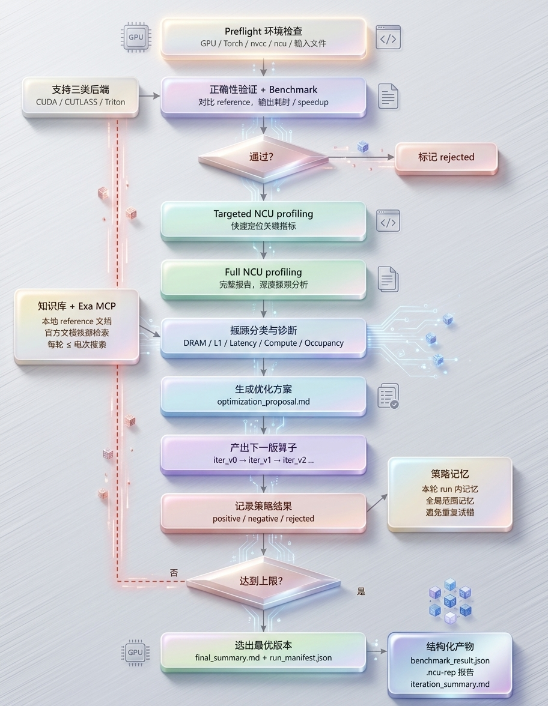
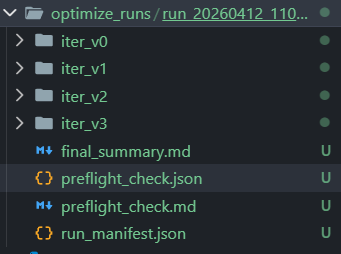
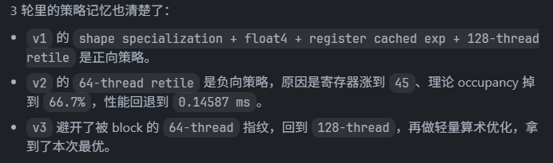

# optimized-skill

这个目录提供一组面向算子优化的 skills，支持 `CUDA / CUTLASS / Triton` 三类后端，覆盖从 correctness、benchmark、NCU profiling 到多轮迭代选优的完整流程。



## 快速使用

```
在agent使用prompt: @optimized-skill 使用这个skill 对 "你想用优化的算子" 进行优化，迭代次数为N次。
```
---
## 包含的 skill

- `skills/optimized-skill/kernel-benchmark/`
  - 统一 benchmark 入口，支持：
    - CUDA/CUTLASS `.cu`（`extern "C" void solve(...)`）
    - Triton `.py`（`setup(...) + run_kernel(...)`）
  - 可选 correctness 对比 reference

- `skills/optimized-skill/ncu-rep-analyze/`
  - 生成或分析 `.ncu-rep`
  - 解释 NCU 指标并映射到可执行优化方向

- `skills/optimized-skill/operator-optimize-loop/`
  - 统一编排入口：
    - correctness -> benchmark -> targeted/full NCU -> proposal -> 下一版算子 -> 再评测
  - 支持策略记忆（positive / negative / rejected）

- `skills/optimized-skill/reference/`
  - 按后端维护知识库：
    - `reference/cuda/`
    - `reference/cutlass/`
    - `reference/triton/`

---

## 推荐入口

需要完整迭代优化时优先使用：
- `skills/optimized-skill/operator-optimize-loop/SKILL.md`

只做 correctness + benchmark：
- `skills/optimized-skill/kernel-benchmark/SKILL.md`

只做 NCU 报告生成与分析：
- `skills/optimized-skill/ncu-rep-analyze/SKILL.md`

---

## 外部文档检索策略（Exa MCP）

为避免只依赖本地 `reference/`，优化过程中必须支持基于 Exa MCP 的外部检索，且优先官方文档。

### 检索原则

1. **优先官方文档**
   - Triton 问题优先检索 Triton 官方文档
   - CUTLASS 问题优先检索 NVIDIA CUTLASS 官方文档
   - CUDA/PTX/NCU 指标问题优先检索 NVIDIA 官方文档

2. **先基于证据再搜索**
   - 先读当前轮 benchmark + full NCU
   - 将瓶颈转成检索关键词，再搜索
   - 不做无目标泛搜

3. **搜索次数上限**
   - 每轮（或每个待解决瓶颈）最多 **10 次搜索**
   - 到达上限后必须收敛：
     - 采用当前最强证据方案
     - 或标注“需下一轮继续验证”

4. **检索结果使用方式**
   - 提取“可执行参数/方法”，不要只摘概念
   - 与当前后端方案融合，不直接照搬无关实现
   - 将采用与未采用原因写入 `optimization_proposal.md`

### 典型检索触发

- Triton：`BLOCK_* / num_warps / num_stages / coalescing / persistent / split-k`
- CUTLASS：`tile shape / stage count / epilogue / stream-k / collective builder`
- CUDA：`occupancy / memory coalescing / latency stall / tensor core path`
- NCU 指标：针对具体瓶颈（如 `dram bound`, `low eligible warps`）检索解决方法

---

## 完整工作流（统一三后端）

1. preflight 检查（设备、工具链、输入文件）
2. 跑 correctness + benchmark（记录 baseline）
3. 跑 targeted NCU
4. 跑 full NCU
5. 写 `optimization_proposal.md`（必须含 `## Strategy tags`）
6. 生成下一版算子
7. 重复 correctness/benchmark/NCU
8. 在用户指定轮数内选出最优版本

从第 2 轮开始，必须以“上一轮 full NCU + benchmark”作为定向优化依据，不做无差别堆技巧。

---

## 策略记忆机制（新增）

`operator-optimize-loop` 会自动沉淀策略记忆，避免重复试错。

### 记忆范围

- 当前 run：`run_manifest.json -> strategy_memory.current_run`
- 全局：`skills/optimized-skill/operator-optimize-loop/strategy-memory/global_strategy_memory.json`

### 自动判定

- `correctness` 失败 -> `rejected`
- benchmark 失败 -> `rejected`
- targeted/full NCU 失败或 full NCU 缺失 -> `rejected`
- 相对上一轮 `kernel median ms` 更快 -> `positive`
- 否则（慢或持平）-> `negative`

### 下一轮约束

- `blocked`：negative + rejected（避免重复采用）
- `preferred`：positive（优先融合）

---

## 用户可配置参数

主入口 `optimize_loop.py` 核心参数：

- `solution_file`（`.cu` 或 `.py`）
- `--backend=<auto|cuda|cutlass|triton>`
- `--ref=<reference.py>`
- `--M=... --N=... --K=...` 等维度参数
- `--max-iterations=<N>`（必填）
- `--warmup=<N>`
- `--repeat=<N>`
- `--arch=<sm_xx>`
- `--gpu=<idx>`
- `--ptr-size=<N>`
- `--seed=<N>`
- `--run-dir=<dir>`
- `--nvcc-bin=<path>`（CUDA/CUTLASS）
- `--ncu-bin=<path>`

---

## 命令示例

### 1) 只做 correctness + benchmark

```bash
python skills/optimized-skill/kernel-benchmark/scripts/benchmark.py path/to/kernel.cu \
    --backend=cuda --ref=path/to/reference.py --M=4096 --N=4096 --K=4096 \
    --warmup=10 --repeat=20
```

### 2) CUDA 完整迭代优化

```bash
python skills/optimized-skill/operator-optimize-loop/scripts/optimize_loop.py path/to/kernel.cu \
    --backend=cuda --ref=path/to/reference.py --M=4096 --N=4096 --K=4096 \
    --max-iterations=3 --warmup=10 --repeat=20
```

### 3) CUTLASS 完整迭代优化

```bash
python skills/optimized-skill/operator-optimize-loop/scripts/optimize_loop.py path/to/cutlass_kernel.cu \
    --backend=cutlass --ref=path/to/reference.py --M=4096 --N=4096 --K=4096 \
    --max-iterations=3 --warmup=10 --repeat=20
```

### 4) Triton 完整迭代优化

```bash
python skills/optimized-skill/operator-optimize-loop/scripts/optimize_loop.py path/to/triton_kernel.py \
    --backend=triton --ref=path/to/reference.py --M=4096 --N=4096 --K=4096 \
    --max-iterations=3 --warmup=10 --repeat=20
```

---

## 输出产物

每次 run 会生成目录：

```text
optimize_runs/
  run_YYYYMMDD_HHMMSS/
    run_manifest.json
    final_summary.md
    preflight_check.md
    preflight_check.json
    iter_v0/
      <kernel>_v0.(cu|py)
      benchmark_result.json
      benchmark.stdout.txt
      benchmark.stderr.txt
      targeted.ncu-rep
      full.ncu-rep
      targeted_summary.txt
      targeted_details.txt
      full_summary.txt
      full_details.txt
      iteration_summary.md
      optimization_proposal.md
    iter_v1/
      ...
```

关键说明：
- `run_manifest.json`：包含参数、每轮结果、best、策略记忆
- `final_summary.md`：汇总轮次、best、策略记忆摘要
- `optimization_proposal.md`：本轮策略假设，需包含 `Strategy tags`

---

## 最优版本评选规则

可参与排名的版本必须满足：
- benchmark 成功
- 若提供 reference，则 correctness 通过
- full `.ncu-rep` 存在

排序：
1. `kernel median latency` 最低
2. `kernel average latency` 最低
3. 更早达到该性能的版本优先

最终交付必须包含：
- 最佳版本路径
- 最佳版本 full NCU 报告路径
- 最佳版本 targeted/full NCU 命令
- baseline vs best benchmark 对比
- 主瓶颈与最终优化思路
- 策略记忆结论（positive/negative/rejected）

---


# 我跑了cutlass softmax算子优化的例子，对比的是torch中softmax函数  下面结果
kernel median 从 v0 的 0.14894 ms 降到 v3 的 0.10245 ms，延迟下降约 31.2%，相当于 1.45x 提升；最终版本对 reference 的 speedup 是 2.04x。主瓶颈已经从“结构性多次读写”收敛到明显的 memory bound：v3 的 NCU 显示 DRAM throughput 约 92.26%、内存带宽约 322.81 GB/s，但仍有 L1TEX scoreboard stall，所以这版已经比较接近这张 RTX 3060 上该 shape 的带宽上限。




## Star History

<a href="https://www.star-history.com/?repos=KernelFlow-ops%2Fcuda-optimized-skill&type=date&legend=top-left">
 <picture>
   <source media="(prefers-color-scheme: dark)" srcset="https://api.star-history.com/chart?repos=KernelFlow-ops/cuda-optimized-skill&type=date&theme=dark&legend=top-left" />
   <source media="(prefers-color-scheme: light)" srcset="https://api.star-history.com/chart?repos=KernelFlow-ops/cuda-optimized-skill&type=date&legend=top-left" />
   
 </picture>
</a>