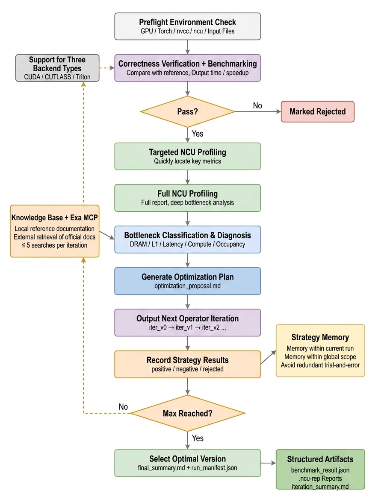
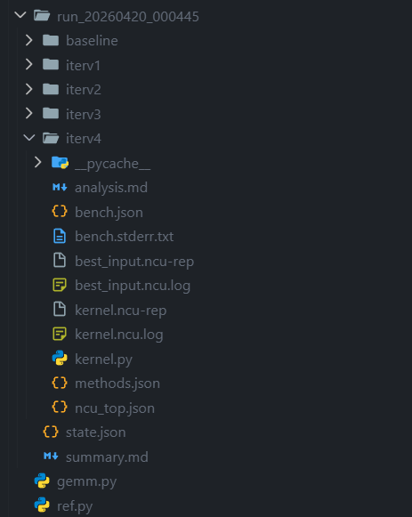
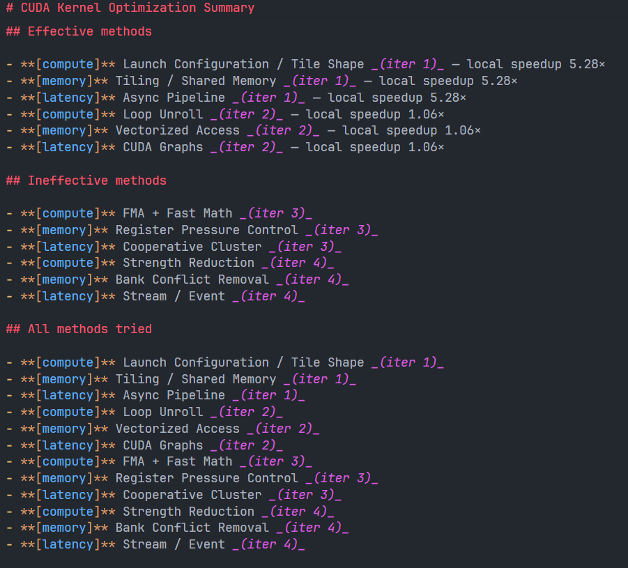

# cuda-kernel-optimizer

**English** | [简体中文](README.zh-CN.md)

A Claude skill that iteratively optimizes a CUDA / CUTLASS / Triton kernel against a Python reference, using `nsight-compute` (`ncu`) as the source of evidence for each optimization decision.

This is a **skill package**, not a standalone tool. Claude reads `SKILL.md` and drives the loop. The scripts under `scripts/` handle the deterministic parts (environment detection, profiling, benchmarking, state).

---



## Usage
```text
Use this prompt in the agent:
@cuda-kernel-optimizer use this skill to optimize "the operator you want to optimize" for N iterations.
```

## What you need

On the host where Claude runs:

- A CUDA GPU with working drivers (`nvidia-smi` works)
- `nvcc` in `$PATH` (for CUDA / CUTLASS backends)
- `ncu` in `$PATH` with permission to read perf counters — without it, the skill degrades to code-static reasoning only, which is significantly weaker
- Python 3.10+ with `torch` (CUDA build), `triton` if you want the Triton backend
- For CUTLASS kernels: `$CUTLASS_PATH` or `$CUTLASS_INCLUDE_DIR` pointing at a tree with both `cutlass/` and `cute/` headers

`benchmark.py` (the generic operator benchmark driver) is bundled at `scripts/benchmark.py` — no separate installation needed.

### `ncu` permission gotcha

On most cloud and container setups, profiling-counter access is disabled. You'll see it as `can_read_counters: false` in `env.json`. Fixes (pick one):

- Run the host as root, or
- Add `options nvidia NVreg_RestrictProfilingToAdminUsers=0` to `/etc/modprobe.d/nvidia.conf` and reboot, or
- For docker: `--cap-add=SYS_ADMIN` (Nsight docs recommend this)

## What you give Claude

1. **Baseline kernel file** — `gemm.cu` (CUDA/CUTLASS) or `gemm.py` (Triton)
2. **Reference file** — `ref.py` exposing `reference(**kwargs)` and optional `atol` / `rtol`
3. **Dims** — the scalar args the signature takes (e.g. `M=4096 N=4096 K=4096`)
4. **Path to `benchmark.py`** — already bundled under `scripts/benchmark.py`; `orchestrate.py` defaults to it. Pass `--benchmark <path>` only if you have a custom version.
5. Optional: iteration count `N` (default 3), `ncu_num` per-axis top-K (default 5), noise threshold (default 2%)

## What you get back

A sibling directory of your baseline, `run_YYYYMMDD_HHMMSS/`, containing:

```text
run_YYYYMMDD_HHMMSS/
├── state.json                   # global state, re-readable across sessions
├── env.json                     # GPU / nvcc / ncu / CUTLASS snapshot
├── baseline/
│   ├── <baseline>               # copied verbatim
│   └── bench.json               # seed timing + correctness
├── iterv1/
│   ├── kernel.{cu,py}           # the iteration's new kernel
│   ├── methods.json             # 3 methods picked (one per axis)
│   ├── analysis.md              # ncu metrics + CoT + risk notes
│   ├── best_input.ncu-rep       # profile of what went IN
│   ├── kernel.ncu-rep           # profile of what came OUT
│   ├── ncu_top.json             # top-K metrics per axis (what Claude sees)
│   └── bench.json
├── iterv2/ …
├── iterv3/ …
└── summary.md                   # headline speedup, timeline, retrospective
```

## Manual invocation

You don't need to drive the loop by hand — that's Claude's job — but for debugging the skill itself:

```bash
# 0 + 0b + 1 + 2 + 3a-for-iter1
python scripts/orchestrate.py setup \
  --baseline   ./gemm.cu \
  --ref        ./ref.py \
  --iterations 3 \
  --ncu-num    5 \
  --dims       '{"M":4096,"N":4096,"K":4096}'
  # --benchmark defaults to scripts/benchmark.py (bundled)

# --- (Claude writes iterv1/kernel.cu + iterv1/methods.json + iterv1/analysis.md) ---

# 3d + 3f + 3a-for-iter2 for iter 1
python scripts/orchestrate.py close-iter \
  --run-dir   run_20260418_143022 \
  --iter      1
  # --benchmark defaults to scripts/benchmark.py (bundled)

# (repeat code-gen + close-iter for iter 2 and iter 3)

# 4
python scripts/orchestrate.py finalize --run-dir run_20260418_143022
```

Each script is independently invocable (`--help` on any of them); `orchestrate.py` is just a convenience wrapper.

## Repo layout

```text
cuda-kernel-optimizer/
├── SKILL.md                         # the skill — Claude reads this
├── README.md                        # you are here
├── scripts/
│   ├── benchmark.py                 # bundled benchmark driver (from project)
│   ├── check_env.py                 # detect GPU / nvcc / ncu / CUTLASS / libs
│   ├── preflight.py                 # validate baseline + ref contract
│   ├── state.py                     # the ONLY writer of state.json
│   ├── validate_methods.py          # priority-compliance gate (called by state.py)
│   ├── run_iteration.py             # calls benchmark.py, captures results
│   ├── profile_ncu.py               # runs ncu, extracts top-K per axis
│   ├── summarize.py                 # renders summary.md
│   └── orchestrate.py               # end-to-end CLI (setup/close-iter/finalize)
├── references/
│   ├── ncu_metrics_guide.md         # bottleneck → optimization mapping
│   ├── optimization_catalog.md      # priority-ordered catalog (Claude reads)
│   └── method_registry.json         # machine-readable mirror (validator reads)
├── templates/
│   ├── iteration_report.md          # analysis.md skeleton Claude fills in
│   └── methods.schema.json          # schema for methods.json
└── examples/
    └── walkthrough.md               # annotated example session
```

## How Claude uses this

When a user says "optimize `gemm.cu`", Claude:

1. reads `SKILL.md`
2. calls `orchestrate.py setup` (which runs env check → preflight → init → seed baseline → first profile)
3. reads `iterv1/ncu_top.json` and the current best kernel source
4. consults `references/optimization_catalog.md` + `references/ncu_metrics_guide.md`
5. picks **3 methods** (one per axis: compute / memory / latency), writes them + reasoning to `iterv1/methods.json` and `iterv1/analysis.md`
6. writes the new kernel to `iterv1/kernel.<ext>` applying all three methods
7. calls `orchestrate.py close-iter --iter 1`
8. on correctness failure: inspects `bench.json.correctness` + `bench.stderr.txt`, rewrites the kernel, retries (up to 3×)
9. on success: state is updated (methods go to effective / ineffective, `best_file` advances if faster)
10. loops back to step 3 for the next iteration
11. calls `orchestrate.py finalize` and writes a retrospective into `summary.md`

See `examples/walkthrough.md` for a full example and `SKILL.md` for the formal procedure.

## Limits and honest caveats

- **Ceiling**: if your reference is already cuBLAS / cuDNN / cuBLASLt, meaningful wins require algorithmic changes (split-K, stream-K, fused epilogues, mixed precision) that Claude may or may not find in a 3-iteration budget. Large speedups are easier when the baseline is hand-rolled.
- **Noise**: kernels running under ~50 μs are dominated by launch overhead. The skill's default 2% noise threshold helps, but if your dims are tiny, raise `--repeat` or the dimensions.
- **Triton + `@triton.autotune`**: autotuning under `ncu` is slow and can time out. Either pre-bake a single config before profiling, or set `--launch-count 1` and increase warmup.
- **ncu CSV column names**: older `ncu` (< 2022.1) emits `"Metric Value"` with different capitalization/units; `profile_ncu.py` is tolerant but if you see all zeros check the `.ncu.log` file in the iteration directory.
- **Retries are bounded**: after 3 correctness failures on one iteration, the skill moves on and records the attempt as failed rather than looping forever. A kernel that can't be made correct after 3 tries usually has a conceptual issue that needs human review.

## Example result

I ran the CUTLASS softmax operator optimization example, using the `softmax` function in PyTorch as the reference. The result is below:

The kernel median dropped from `0.14894 ms` in v0 to `0.10245 ms` in v3, a latency reduction of about `31.2%`, equivalent to a `1.45x` improvement. The final version achieved a `2.04x` speedup relative to the reference. The main bottleneck has already converged from "structural multiple read/write passes" to an obvious memory-bound regime: the v3 NCU report shows DRAM throughput around `92.26%` and memory bandwidth around `322.81 GB/s`, while there is still some L1TEX scoreboard stall. So this version is already fairly close to the bandwidth ceiling for this shape on the RTX 3060.




## License / attribution

This skill is independent of and does not redistribute CUTLASS, Triton, or Nsight Compute. You need to install those separately.

## Star History

<a href="https://www.star-history.com/?repos=KernelFlow-ops%2Fcuda-optimized-skill&type=date&legend=top-left">
 <picture>
   <source media="(prefers-color-scheme: dark)" srcset="https://api.star-history.com/chart?repos=KernelFlow-ops/cuda-optimized-skill&type=date&theme=dark&legend=top-left" />
   <source media="(prefers-color-scheme: light)" srcset="https://api.star-history.com/chart?repos=KernelFlow-ops/cuda-optimized-skill&type=date&legend=top-left" />
   
 </picture>
</a>
