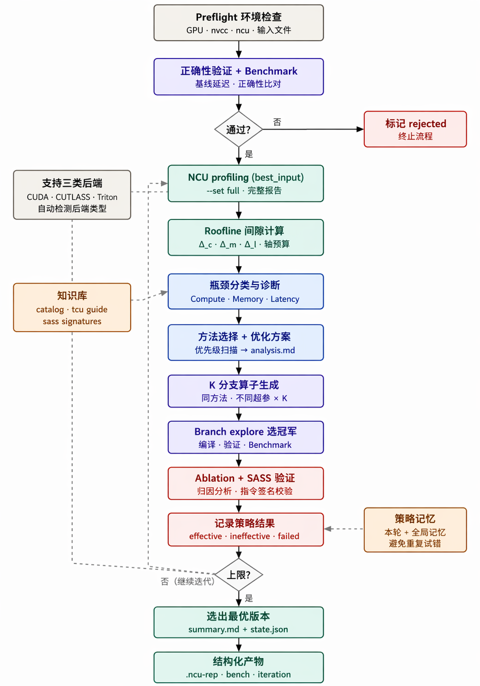
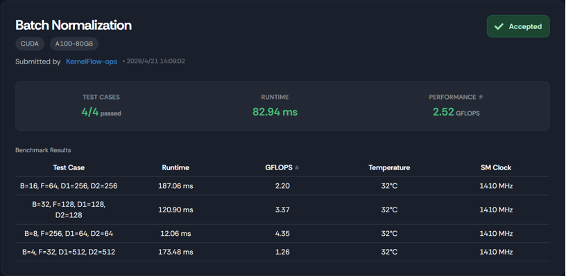
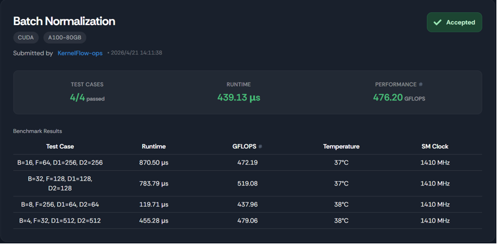

# cuda-kernel-optimizer

[English](README.md) | **简体中文**

一个 Claude skill，用于围绕 Python reference 对 CUDA / CUTLASS / Triton kernel 进行迭代优化，并使用 `nsight-compute`（`ncu`）作为每次优化决策的证据来源。

这是一个 **skill package**，不是独立工具。Claude 会读取 `SKILL.md` 并驱动整个循环。`scripts/` 下的脚本负责确定性的部分（环境检测、profiling、benchmarking、state 管理）。

---



## 使用方法
```text
在 agent 中使用下面的 prompt：
@cuda-kernel-optimizer 使用这个 skill 对“你想优化的算子”进行优化，迭代次数为 N 次。
```

## 新增内容

V2 把循环从“试错–记录”升级为“试错–归因–验证–学习”。在 V1 基础上新增了四个机制，下文所有描述均反映 V2 行为：

- **Roofline 驱动的轴预算分配** — 取代 V1 固定的“每个 axis 选 1 个方法”，V2 每轮先计算 compute / memory / latency 三个间隙（Δc、Δm、Δl），然后按比例把总预算 3 个方法名额切给三个 axis（单轴上限 2）。当三个 Δ 全部小于 0.15 时输出 `near_peak: true`，循环提前终止。
- **Branch-and-Select 分支探索** — 每次迭代基于同一组方法生成 K 个分支候选（默认 K=4），它们共享方法但在 tile size / pipeline stages / warp 数 / 实现变体上各不相同。最快且正确的分支被选为 champion，其余归入 `frontier` 归档。
- **Ablation 消融归因** — champion 选出后对每个方法做逐一消融（leave-one-out）。`attribution(m) = ms_without_m − ms_champion` 给出单个方法的因果贡献值，取代 V1 那种“三个打包一起判定”的粗粒度判断。
- **SASS 指令级验证** — 对 champion 调用 `cuobjdump --dump-sass`，并按签名表（`sass_signatures.json`）去 grep，确认每个声称的优化方法是否真的出现在编译后的机器码中。

这四项共同把方法分类从“effective / ineffective”两个桶升级为三个桶：`effective_methods`（SASS ✓ 且归因超过噪声阈值）、`ineffective_methods`（SASS ✓ 但归因未超过阈值）、`implementation_failed_methods`（SASS ✗）。

## 你需要准备什么

在 Claude 运行的宿主机上：

- 一块可用的 CUDA GPU，并且驱动正常（`nvidia-smi` 可运行）
- `$PATH` 中有 `nvcc`（用于 CUDA / CUTLASS backend）
- `$PATH` 中有 `ncu`，并且有权限读取性能计数器；否则这个 skill 会退化为仅基于代码静态分析的推理能力，效果会明显变弱
- `$PATH` 中有 `cuobjdump`（CUDA toolkit 自带）— V2 的 SASS 验证步骤需要它
- Python 3.10+，安装了 `torch`（CUDA 版本）；如果要用 Triton backend，还需要 `triton`
- 对于 CUTLASS kernel：`$CUTLASS_PATH` 或 `$CUTLASS_INCLUDE_DIR` 需要指向同时包含 `cutlass/` 和 `cute/` 头文件的目录树

`benchmark.py`（通用算子 benchmark driver）已经内置在 `scripts/benchmark.py` 中，不需要单独安装。

### `ncu` 权限常见问题

在大多数云环境和容器环境中，profiling counter 访问默认是关闭的。你会在 `env.json` 中看到 `can_read_counters: false`。可选修复方式如下：

- 以 root 身份运行宿主机，或者
- 在 `/etc/modprobe.d/nvidia.conf` 中加入 `options nvidia NVreg_RestrictProfilingToAdminUsers=0` 并重启，或者
- 对于 docker：使用 `--cap-add=SYS_ADMIN`（Nsight 文档推荐）

## 你需要提供给 Claude 的内容

1. **Baseline kernel 文件**：`gemm.cu`（CUDA/CUTLASS）或 `gemm.py`（Triton）
2. **Reference 文件**：`ref.py`，需要暴露 `reference(**kwargs)`，并可选提供 `atol` / `rtol`
3. **Dims**：该签名所需的标量参数（例如 `M=4096 N=4096 K=4096`）
4. **`benchmark.py` 路径**：已经内置在 `scripts/benchmark.py` 下；`orchestrate.py` 默认使用它。只有在你有自定义版本时才需要传 `--benchmark <path>`
5. 可选：迭代次数 `N`（默认 3）、每个 axis 的 `ncu_num` top-K（默认 5）、噪声阈值（默认 2%）、**每轮分支数 `K`（默认 4，通过 `--branches` 传入）**

## 你会得到什么

在 baseline 同级目录下，会生成一个 `run_YYYYMMDD_HHMMSS/` 目录，内容如下：

```text
run_YYYYMMDD_HHMMSS/
├── state.json                   # 全局状态，可跨会话重新读取
│                                #   V2 新增：branches、implementation_failed_methods、
│                                #           roofline_history、frontier
├── env.json                     # GPU / nvcc / ncu / CUTLASS 环境快照
├── baseline/
│   ├── <baseline>               # 原样复制的 baseline
│   └── bench.json               # 初始时延与正确性结果
├── iterv1/
│   ├── roofline.json            # Δc / Δm / Δl 以及每个 axis 的预算分配
│   ├── methods.json             # 预算下选出的方法（含 trigger_strength）
│   ├── analysis.md              # ncu 指标 + CoT + 风险说明
│   ├── best_input.ncu-rep       # 输入版本的 profile
│   ├── branches/                # K 个分支候选（方法相同，超参不同）
│   │   ├── b0/kernel.{cu,py} + bench.json
│   │   ├── b1/…
│   │   └── …
│   ├── kernel.{cu,py}           # champion kernel（最快且正确的分支）
│   ├── kernel.ncu-rep           # champion 的 profile
│   ├── ncu_top.json             # 每个 axis 的 top-K 指标（Claude 实际看到的内容）
│   ├── sass_check.json          # 每个方法的 SASS 签名验证结果
│   ├── ablations/               # leave-one-out 消融实验的产物
│   │   ├── no_<method_a>/kernel.{cu,py} + bench.json
│   │   └── …
│   ├── attribution.json         # 每个方法的因果贡献（ms）
│   └── bench.json
├── iterv2/ …
├── iterv3/ …
└── summary.md                   # 总体加速、时间线、瓶颈漂移与回顾总结
```

## 手动调用

你不需要手动驱动整个循环，这本来就是 Claude 的工作；不过如果你想调试这个 skill 本身，可以这样做：

```bash
# 0 + 0b + 1 + 2 + 3a-for-iter1
python scripts/orchestrate.py setup \
  --baseline   ./gemm.cu \
  --ref        ./ref.py \
  --iterations 3 \
  --ncu-num    5 \
  --branches   4 \
  --dims       '{"M":4096,"N":4096,"K":4096}'
  # --benchmark 默认使用 scripts/benchmark.py（已内置）

# --- （Claude 会写入 iterv1/kernel.cu + iterv1/methods.json + iterv1/analysis.md
#       以及 iterv1/branches/ 下的 K 个分支候选） ---

# 3d + 3f + 3a-for-iter2 for iter 1
# close-iter 内部会依次执行：分支选拔 → SASS 验证 → 消融归因 → state 更新
python scripts/orchestrate.py close-iter \
  --run-dir   run_20260418_143022 \
  --iter      1
  # --benchmark 默认使用 scripts/benchmark.py（已内置）

# （对 iter 2 和 iter 3 重复代码生成 + close-iter）

# 4
python scripts/orchestrate.py finalize --run-dir run_20260418_143022
```

每个脚本都可以单独调用（对任意脚本执行 `--help` 即可）；`orchestrate.py` 只是一个便捷封装。

## 仓库结构

```text
cuda-kernel-optimizer/
├── SKILL.md                         # skill 本体，Claude 会读取它
├── README.md                        # 当前英文文档
├── scripts/
│   ├── benchmark.py                 # 内置 benchmark driver（来自项目）
│   ├── check_env.py                 # 检测 GPU / nvcc / ncu / cuobjdump / CUTLASS / 依赖库
│   ├── preflight.py                 # 校验 baseline 与 ref 的契约
│   ├── state.py                     # state.json 的唯一写入者
│   ├── validate_methods.py          # 优先级合规校验器（由 state.py 调用）
│   ├── run_iteration.py             # 调用 benchmark.py 并采集结果
│   ├── profile_ncu.py               # 运行 ncu，并提取每个 axis 的 top-K
│   ├── roofline.py                  # [V2] 计算 Δc/Δm/Δl、分配轴预算、判断 near_peak
│   ├── branch_explore.py            # [V2] 编译并 benchmark K 个分支，选出 champion，维护 frontier
│   ├── ablate.py                    # [V2] leave-one-out 消融实验，产出每方法的归因值
│   ├── sass_check.py                # [V2] cuobjdump → grep 签名 → 每个方法的 SASS 验证结果
│   ├── summarize.py                 # 渲染 summary.md（V2: 含瓶颈漂移表）
│   └── orchestrate.py               # 端到端 CLI（setup/close-iter/finalize）
├── references/
│   ├── ncu_metrics_guide.md         # 瓶颈到优化方法的映射
│   ├── optimization_catalog.md      # 按优先级排序的优化目录（Claude 会读）
│   ├── method_registry.json         # 机器可读镜像（validator 会读）
│   └── sass_signatures.json         # [V2] 方法 → 期望出现的 SASS 指令签名
├── templates/
│   ├── iteration_report.md          # analysis.md 的骨架模板，由 Claude 填写
│   └── methods.schema.json          # methods.json 的 schema（V2: 新增 trigger_strength）
└── examples/
    └── walkthrough.md               # 带注释的完整示例流程
```

## Claude 如何使用它

当用户说“优化 `gemm.cu`”时，Claude 会：

1. 读取 `SKILL.md`
2. 调用 `orchestrate.py setup`（其中会执行 env check → preflight → init → seed baseline → first profile）
3. 读取 `iterv1/ncu_top.json` 和当前最佳 kernel 源码
4. **运行 `roofline.py` 得到 Δc / Δm / Δl 以及每个 axis 的方法预算（总预算 3、单轴上限 2）；如果 `near_peak: true`，循环到此结束**
5. 查阅 `references/optimization_catalog.md` 与 `references/ncu_metrics_guide.md`
6. 在 **轴预算约束下** 选择方法（预算感知扫描：预算为 0 的 axis 直接跳过，预算为 2 的 axis 按 `trigger_strength` 取前 N 名），并把它们和推理过程写入 `iterv1/methods.json` 与 `iterv1/analysis.md`
7. 将 **K 个分支候选** 写入 `iterv1/branches/b{0..K-1}/kernel.<ext>` — 方法相同，但 tile / stages / warps / 实现变体各不相同
8. 调用 `orchestrate.py close-iter --iter 1`，它内部会：
   - 运行 `branch_explore.py` → 编译 + benchmark 所有分支，选出最快且正确的那个作为 champion（复制到 `iterv1/kernel.<ext>`），其余归入 `frontier`
   - 用 `ncu` profile champion → `iterv1/kernel.ncu-rep`
   - 运行 `sass_check.py` → `iterv1/sass_check.json`
   - 运行 `ablate.py` → `iterv1/attribution.json`
   - 更新 state：每个方法按 `SASS ✓/✗ × 归因值是否超过噪声` 进入 `effective_methods` / `ineffective_methods` / `implementation_failed_methods` 之一
9. 如果正确性失败（所有 K 个分支都失败）：检查 `bench.json.correctness` 与 `bench.stderr.txt`，重写 kernel，并重试（最多 3 次）
10. 如果成功：若更快则推进 `best_file`；本轮 roofline 结果追加进 `roofline_history`
11. 回到第 3 步，进入下一轮迭代
12. 调用 `orchestrate.py finalize`，并将回顾总结写入 `summary.md` — 其中包含来自 `roofline_history` 的瓶颈漂移表

完整示例请见 `examples/walkthrough.md`，正式流程请见 `SKILL.md`。

## 限制与真实注意事项

- **上限**：如果你的 reference 已经是 cuBLAS / cuDNN / cuBLASLt，那么要获得显著提升通常需要算法级改动（如 split-K、stream-K、fused epilogues、mixed precision），Claude 在 3 轮预算内不一定能找到。baseline 是手写实现时，通常更容易得到大幅加速。
- **噪声**：当 kernel 运行时间低于约 `50 μs` 时，launch overhead 会占主导。skill 默认的 2% 噪声阈值有所帮助，但如果 dims 很小，建议提高 `--repeat` 或直接增大维度。消融归因也使用同一阈值 —— 低于噪声的贡献会被归为 `ineffective_methods`。
- **Triton + `@triton.autotune`**：在 `ncu` 下做 autotuning 会很慢，甚至超时。建议在 profiling 前先固定为单一 config，或者设置 `--launch-count 1` 并提高 warmup。
- **ncu CSV 列名**：较旧版本的 `ncu`（< 2022.1）会输出 `"Metric Value"`，其大小写和单位格式可能不同；`profile_ncu.py` 做了兼容处理，但如果你看到全 0，先检查迭代目录下的 `.ncu.log` 文件。
- **分支成本**：当 K=4 且开启消融时，每轮迭代最多要编译 K + (方法数) 个 kernel。在干净环境下首次构建会比较慢；如果更看重墙钟时间，可适当降低 `--branches`。
- **SASS 签名是启发式的**：`sass_signatures.json` 只是按指令模式做 grep，并不做完整的语义等价判定。一个方法可能通过了 grep 但实现依然次优 —— 这正是归因机制要兜住的部分。
- **重试是有上限的**：单轮迭代最多允许 3 次正确性失败。超过后，skill 会记录这次尝试失败并继续往下，而不是无限循环。一个 kernel 如果 3 次都无法修正，通常意味着存在需要人工审查的概念性问题。

## 示例结果

https://tensara.org/problems  以 Tensara 平台上的 Batch Normalization 题目为例，本项目展示了从基础实现到优化版本的显著性能提升。提交到 A100-80GB 环境后，程序 4/4 测试全部通过，平均运行时间由 82.94 ms 大幅降低到 439.13 μs，整体吞吐从 2.52 GFLOPS 提升至 476.20 GFLOPS。需要说明的是，日常开发与调优主要在本地 RTX 3060 环境中完成，因此本地结果无法完全体现 A100 的性能上限；最终性能数据以上述平台实测结果为准。





## 许可证 / 说明

这个 skill 独立于 CUTLASS、Triton 和 Nsight Compute，也不重新分发它们。你需要自行安装这些依赖。

## Star History

<a href="https://www.star-history.com/?repos=KernelFlow-ops%2Fcuda-optimized-skill&type=date&legend=top-left">
 <picture>
   <source media="(prefers-color-scheme: dark)" srcset="https://api.star-history.com/chart?repos=KernelFlow-ops/cuda-optimized-skill&type=date&theme=dark&legend=top-left" />
   <source media="(prefers-color-scheme: light)" srcset="https://api.star-history.com/chart?repos=KernelFlow-ops/cuda-optimized-skill&type=date&legend=top-left" />
   
 </picture>
</a>

